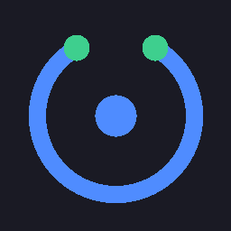

# OpenHarness

**O agente de código no seu PC. Um `.exe`. Os modelos que você já paga.**

<p align="center">
  
</p>

OpenHarness é o [DeepSeek Harness](https://github.com/deepseek-ai/deepseek-harness) em app Windows: sidecar Node local, UI oficial, sessões e chaves no seu disco. Sem nuvem no meio. Sem agente aninhado (Cursor Cloud / SDK). O loop fala direto com o provedor.

[Download](https://github.com/JohnPitter/openharness/releases/latest) · [Releases](https://github.com/JohnPitter/openharness/releases) · [Notas para agentes](AGENTS.md)

## Começar

1. Abra a [release mais recente](https://github.com/JohnPitter/openharness/releases/latest) e baixe `openharness.exe`.
2. Execute. Na primeira abertura o runtime vai para `%LOCALAPPDATA%\openharness\runtime`.
3. Em **Settings → Modelos**, ligue um card (Kimi, Claude Code, Codex, GLM, OpenCode ou DeepSeek) e crie uma sessão.

Windows 10/11 x64. [WebView2](https://developer.microsoft.com/microsoft-edge/webview2/) já vem no Windows recente.

O app consulta as GitHub Releases públicas. Quando há uma tag mais nova, a titlebar mostra **vX.Y.Z disponível → Atualizar**. O exe é trocado e o app reabre.

## O que faz

| | |
| --- | --- |
| **No seu PC** | Sidecar local. Sessões e chaves em `%LOCALAPPDATA%\openharness\dsh-home`. |
| **Os planos que você já tem** | Kimi for Code, Claude Code, Codex, GLM Coding Plan, OpenCode Zen, DeepSeek. Sign in no card ou cola o token. |
| **Workflow** | O planejador só pensa e delega. O trabalhador pesquisa e edita, no modelo do chip da direita; trocar o preset compacta antes do próximo prompt. |
| **Marcos** | O modelo que fecha o trabalho grava um marco; o trilho à esquerda empilha ticks do topo, sem esticar na coluna. Clique abre o preview; clique fora volta ao padrão. |
| **Editar mensagem** | Mensagens de usuário enviadas podem ser revisadas em uma nova sessão sem alterar a original. |
| **Busca na web** | DuckDuckGo por padrão, sem chave extra. A busca nativa DeepSeek fica desligada (ela cobra saldo DeepSeek mesmo se o chat for outro). |
| **Remote** | Opt-in na sidebar. Túnel HTTPS + QR; o celular usa o harness completo enquanto o PC está ligado. |
| **J-Space** | Protocolo de construção nos modos Standard, Code e Workflow: classifica o trabalho e carrega só o que a tarefa precisa. |

## Provedores

Um card por família na lista padrão (Settings → Modelos):

| UI | Rota | Chave | Uso |
| --- | --- | --- | --- |
| Kimi for Code | `kimi-for-coding` | `KIMI_API_KEY` | API Kimi for Coding |
| DeepSeek | `deepseek-official` | `DEEPSEEK_API_KEY` | API DeepSeek |
| Claude Code | `claude-code` | `CLAUDE_CODE_OAUTH_TOKEN` | Plano Pro/Max (Sign in ou `claude setup-token`) |
| Codex | `openai-codex` | `CODEX_ACCESS_TOKEN` | Plano ChatGPT Codex (JWT) |
| GLM Coding Plan | `zai` | `ZAI_API_KEY` | Coding Plan Z.AI |
| OpenCode | `opencode` | `OPENCODE_API_KEY` | [Zen](https://opencode.ai/docs/zen) (`https://opencode.ai/zen/v1`) |

Console Anthropic e OpenAI Platform entram em **Adicionar provedor**. A chave OpenCode sai de [opencode.ai/auth](https://opencode.ai/auth).

## Como encaixa

- O **shell** (Wails v2) é a janela: titlebar, auto-update, Remote.
- O **sidecar** é o harness: `node` embutido + árvore de plugins extraída no disco (o loader Cordis precisa de arquivos reais, não de um FS virtual).
- A **UI** é a web oficial do harness, em iframe full-bleed.

Não é um gateway multi-canal nem um bot de WhatsApp. É o loop de coding agent, no desktop, com o modelo que você escolher.

## Remote

Opt-in. O exe publica um HTTPS público a partir de `127.0.0.1` (túnel Cloudflare). Quem tiver o link vivo tem o mesmo poder que o desktop: todas as sessões, ferramentas, o workspace. Use só em rede em que você confia. A primeira vez baixa `cloudflared` para `%LOCALAPPDATA%\openharness\cloudflared`.

## Desenvolvimento

```powershell
wails generate module
Copy-Item -Recurse -Force frontend\wailsjs frontend\dist\wailsjs
wails build -ldflags "-X openharness/internal/update.Version=0.1.24"
go test ./...
```

O zip `dsh-runtime` e o `node.exe` **não** entram no git (`internal/sidecar/assets/`). Sem eles o `wails build` local não embute o sidecar.

Rebuild da face web (marca OpenHarness):

```powershell
cd deepseek-harness
$env:DSH_CLIENT_BUILD_PROFILE = 'official'
$env:DSH_CLIENT_TITLE = 'OpenHarness'
pnpm run build:lib:client
pnpm --filter @deepseek-ai/dsh-web-frontend run build
```

Pipeline do runtime, OAuth e cotas: [`AGENTS.md`](AGENTS.md).

| Workflow | Quando | O que faz |
| --- | --- | --- |
| [CI](.github/workflows/ci.yml) | push/PR | `go test` / `go vet` |
| [Release](.github/workflows/release.yml) | tag `v*.*.*` | cria a GitHub Release |

```powershell
git tag v0.1.24
git push origin v0.1.24
gh release upload v0.1.24 build/bin/openharness.exe
```

O auto-update procura o asset exatamente chamado `openharness.exe`.

```
main.go                 # janela Wails
internal/sidecar/       # extrai zip+node, sobe dsh web
internal/update/        # check/apply via GitHub Releases
internal/remote/        # túnel + QR
frontend/dist/          # titlebar + iframe
deepseek-harness/       # fonte do harness (overlay OpenHarness)
```

O SQLite de sessão do rc.8 (v2) **não** lê o storage antigo. Se a UI não subir sessões de um exe rc.5, apague ou renomeie `%LOCALAPPDATA%\openharness\dsh-home`.

## Licença

O shell OpenHarness segue o mesmo espírito do harness original. O código em `deepseek-harness/` permanece sob a licença do projeto DeepSeek Harness.
